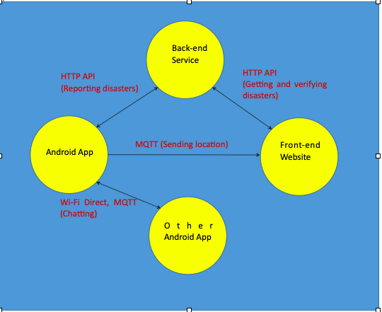
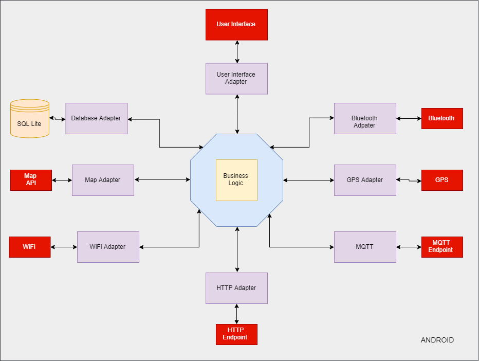
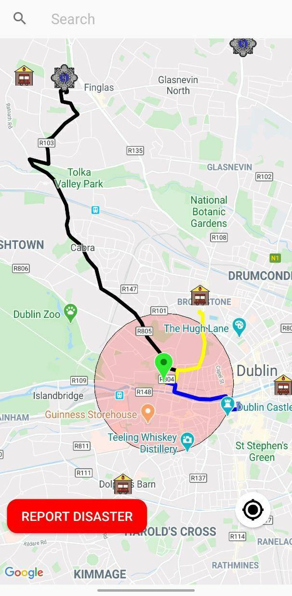
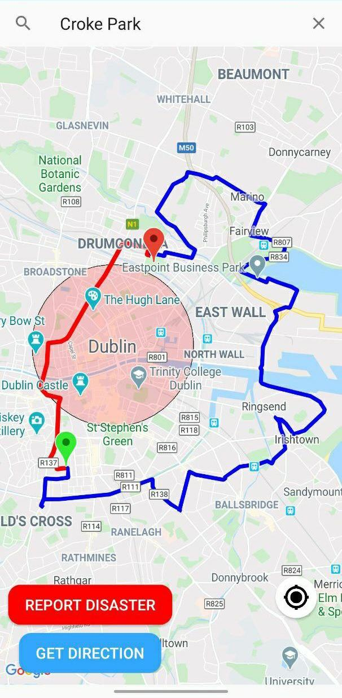
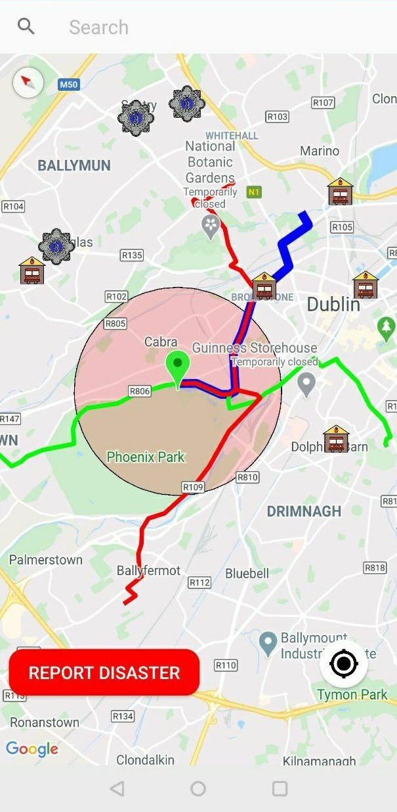
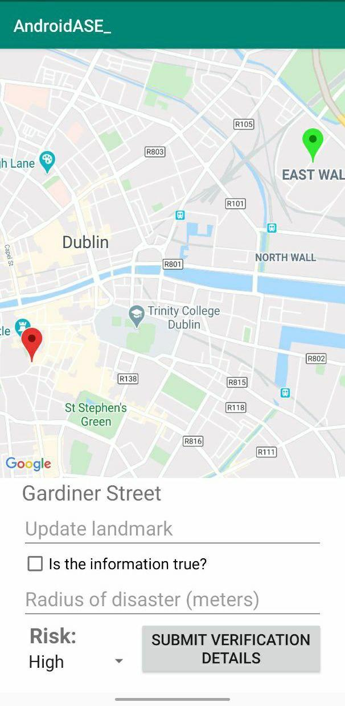

# RSCD_android

**Overview**

We implemented the backend using Microservice architecture. The microservice architecture comprises independent modular services where each service solves a specific problem or performs a unique task and these modules communicate with each other through well-defined API to serve the business goal.

**Components**

* A mobile application (Android) for registered users ([Link](https://github.com/guroosh/City-Disaster-Management---Android)).

* A web application for admin users.

* A database server describing the various Business Logics ([Link](https://github.com/guroosh/City-Disaster-Management---Backend)).

* Non relational database (MongoDB).

**Concept**

We adopted an Extreme programming (XP) development methodology which included Pair programming and Test driven development. 
Production deployment was done using AWS EC2 instances.

  

**Android application**

The android application has been developed for users (citizens and field agents) to report disasters, verify disaster and receive notifications or alerts during a disaster.

 
 
* Programing languages:
    * Java
    * XML

* IDE:
    * Android Studio

* APIs:
    * Google Map API: Used to simulate vehicles moving around Dublin, disaster location, exit plan for the user and re-routed routes to avoid the disaster zone.
    * Firebase API: Used for real time push notifications from the server.
    * Dublin Bus API: Used to simulate real time bus schedule.

* Sensors:
    * GPS: Used for getting real time user location.
    
* Protocols:
    * HTTP: Used for requesting updates from the server.
    * MQTT: Used for getting alerts and notifications.

* Data Storage:
  * SQLLite: Used for storing data locally.
    
* Application UI:
   * Exit routes.
   * Rerouting.
   * Evacuation routes showing entry and exit routes.
   * Admin disaaster verification form.
   
   &nbsp;
   
  
  
  
  
  
